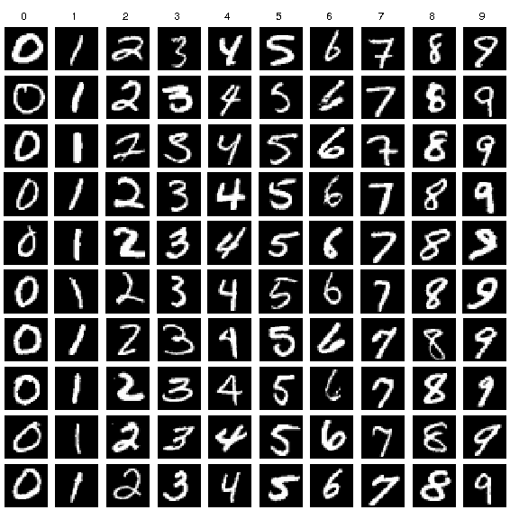
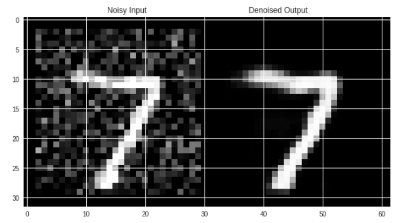

# Denoising-Autoencoders-for-MNIST-Data-Classification
This is a Denoising Autoencoders based MNIST handwritten digits data classication program. Pytorch library has been used for implementing neural networks.  
### About Dataset
MNIST handwritten digit dataset contains 60,000 training and 10,000 testing 28*28 black and white images. 
  
### Sample Denoised output

